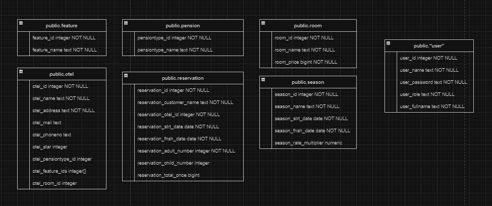
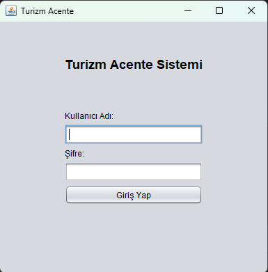
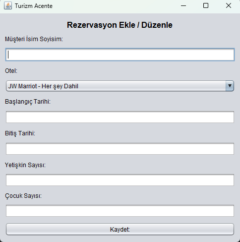

# Turizm Acentesi Projesi

Bu proje, Patika+ Backend Programı için Bitirme Projesi olarak geliştirilmiştir. Proje, bir turizm acentesi yönetim sistemini simüle etmektedir.
# Veritabanı Şeması
turizmacente.sql



https://github.com/Snmzgrkn/TurizmAcenteProjesi/assets/56911478/6c2bd6cd-6a52-47c1-9fa6-2dcf8a8bc2e3


<video src='images/Turizm Acente 2024-04-30 21-41-19.mp4' width=180/>




-------------------------------------------------------------
## Kullanılan Teknolojiler

- Java
- Swing (GUI)
- PostgreSQL (Veritabanı)
- JDBC (Java Veritabanı Bağlantısı)

## Projeyi Çalıştırma

Proje Java ve Maven ile geliştirildiği için bilgisayarınızda Java ve Maven'in yüklü olması gerekmektedir. Ayrıca PostgreSQL veritabanı da kullanılmaktadır, bu nedenle PostgreSQL sunucusunun da kurulu olması gerekmektedir.

1. Projenin kaynak kodlarını bilgisayarınıza klonlayın:

   ```
   git clone https://github.com/kullanici/proje.git
   
PostgreSQL veritabanında otel adında bir veritabanı oluşturun.

  ```
  db.url=jdbc:postgresql://localhost:5432/otel
  db.user=kullanici
  db.password=sifre
```
24.04.2024 Readme 23:59 olmadan düzeltilecek
# Eksik Kısımlar
- Arama Kısımları
- Rezervasyon Güncelleme Silme 
- Otel Ekleme(Tesis Özellikleri Eklenirken Tip Sorunu Çıkıyor)
  
# Kriterler
1.✅ 2.✅ 3.✅ 4.✅ 5.✅ 6.✅ 7.✅ 8.✅ 9.✅ 10.✅ 11.✅ 12.✅ 13.✅ 14.✅ 15.✅ 16.✅ 17.✅ 18.✅ 19.❌ 20.✅ 21.❌ 22.✅ 23.❌ 24.✅ 25.✅ 
